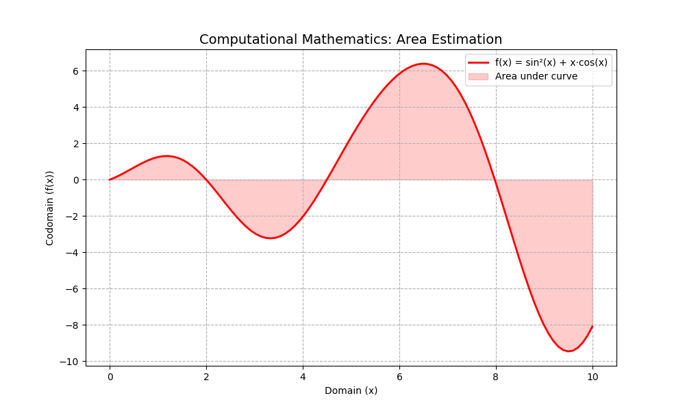

# 🔢 HBKU Computational Mathematics Labs
> **A Comprehensive Python-Based Laboratory for Numerical Analysis, Calculus, and Scientific Modeling**

Welcome to the **HBKU Mathematics Computational Labs**. This repository is a sophisticated bridge between abstract mathematical theory and practical computational verification. Designed for **Calculus I-II**, **Precalculus**, and **Scientific Computing**, it leverages the Power of Python to visualize and solve complex mathematical structures.

---

## 🔬 Core Laboratory Domains

### 1. Limits & Continuity | `labs/limits-continuity/`
*Exploring the behavior of functions at the edge.*
- **Numerical Intuition:** Left-hand and right-hand limit verifications.
- **Visual Analysis:** Modeling jump and removable discontinuities.
- **Mathematical Rigor:** Precision checks for $\epsilon - \delta$ limit definitions.

### 2. Differential Calculus | `labs/derivatives/`
*The mathematics of change and optimization.*
- **Approximations:** Difference quotient modeling and error rate analysis.
- **Optimization:** Solving extrema problems through numerical and visual gradients.
- **Tangent Dynamics:** Linear approximation and convergence behavior.

### 3. Integral Calculus | `labs/integration/`
*Accumulation and the geometry of continuous data.*
- **Riemann Sums:** Comparisons of Left, Right, and Midpoint approximations.
- **Numerical Quadrature:** Implementing Trapezoidal and Simpson-style integration methods.
- **Fundamental Theorem:** Visualizing the relationship between accumulation and differentiation.

### 4. Sequences & Series | `labs/sequences-series/`
*Convergence, divergence, and series expansion.*
- **Taylor Series:** Modeling function approximations: $f(x) \approx \sum_{n=0}^{\infty} \frac{f^{(n)}(a)}{n!}(x-a)^n$
- **Partial Sums:** Visualizing the rate of convergence for infinite series.

### 5. Scientific Computing & Modeling | `labs/scientific-computing-modeling/`
*Applied numerical methods for real-world phenomena.*
- **Differential Equations:** Modeling system dynamics using Euler and Runge-Kutta (RK) methods.
- **Physical Simulations:** Numerical modeling of diffusion and heat transfer patterns.

---

### 🔬 Scientific Case Study: Numerical Integration Benchmark
To demonstrate the lab's computational capabilities, here is a visualization of a numerical integration analysis using the **Trapezoidal Rule** versus the **Exact Integral**.

<p align="center">
  
</p>

**Analysis Highlights:**
* **Function:** $f(x) = \sin^2(x) + x \cdot \cos(x)$
* **Methodology:** Utilizing `NumPy` for vectorized domain generation and `Matplotlib` for high-fidelity area visualization.
* **Objective:** This simulation verifies the convergence of numerical approximations in non-trivial oscillating functions.

---

## 🛠️ Technological Stack
* **Language:** Python 3.10+
* **Libraries:** `NumPy` (Vectorized computations), `Matplotlib` (High-fidelity visualization), `SciPy` (Scientific algorithms), `SymPy` (Symbolic mathematics).

---

## 🚀 Quick Start (Installation & Setup)

1. **Install Python:** Ensure Python 3.10+ is installed and added to your **PATH**.
2. **Setup Virtual Environment:**
   ```powershell
   python -m venv .venv
   .\.venv\Scripts\activate

3. Install Dependencies:
   ```powershell
   pip install -r requirements.txt


## 👨‍🏫 About the Author: Dr. Ozhan Akdag
- Doctorate (Ph.D.) in Mathematics & Education.
- Current Location: Doha, Qatar.
- Specialization: Pure & Applied Mathematics, Statistical Modeling, and STEM Education.

"Mathematics is not just about solving for x; it's about understanding why x matters."
